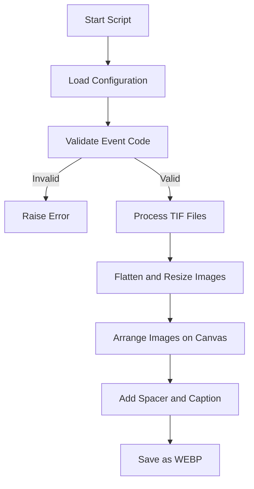

<h1 align="center">🎨 <a href="https://github.com/ronknight/landing-page-banner-automation">Landing Page Banner Automation</a></h1>

<h4 align="center">🖼️ Automate banner creation by combining TIF images, event themes, and captions into stunning designs for landing pages.</h4>

<p align="center">
<a href="https://twitter.com/PinoyITSolution"></a>
<a href="https://github.com/ronknight?tab=followers"></a>
<a href="https://github.com/ronknight/landing-page-banner-automation/stargazers"></a>
<a href="https://github.com/ronknight/landing-page-banner-automation/network/members"></a>
<a href="https://youtube.com/@PinoyITSolution"></a>
<a href="https://github.com/ronknight/landing-page-banner-automation/issues"></a>
<a href="https://github.com/ronknight/landing-page-banner-automation/blob/master/LICENSE"></a>
<a href="https://github.com/ronknight"></a>
</p>

<p align="center">
  <a href="#project-overview">Project Overview</a> •
  <a href="#features">Features</a> •
  <a href="#installation">Installation</a> •
  <a href="#usage">Usage</a> •
  <a href="#file-structure">File Structure</a> •
  <a href="#visualization">Visualization</a> •
  <a href="#disclaimer">Disclaimer</a>
</p>

---

## 📋 Project Overview

This project automates the creation of banners for landing pages by combining product images, captions, and event-specific themes into visually appealing designs. The script uses ImageMagick and Wand to process images and dynamically adjusts the layout for optimal presentation.

---

## ✨ Features

- Flatten and process TIF images into banners.
- Customizable event themes via `events.json`.
- Automatic grid-based layout for multiple products.
- Add captions and themed spacers for professional designs.
- Save banners in lightweight `.webp` format.

---

## 🛠️ Installation

1. **Clone the Repository**:
   ```bash
   git clone https://github.com/ronknight/landing-page-banner-automation.git
   cd landing-page-banner-automation
   ```

2. **Install Dependencies**:
   - Python 3.7+ is required.
   - Install required packages:
     ```bash
     pip install -r requirements.txt
     ```

3. **Set Up Environment**:
   - Create a `.env` file in the root directory:
     ```env
     TIFF_DIRECTORY=/path/to/tiff/files
     ```
   - Add the path where your TIF files are stored.

4. **Install ImageMagick**:
   - Download and install [ImageMagick](https://imagemagick.org/) (ensure the `magick.exe` binary is in your PATH).

---

## 🚀 Usage

1. **Run the Script**:
   ```bash
   python banner_creator.py [item_numbers] -c "Your Caption" -e EVENT_CODE
   ```
   - Replace `[item_numbers]` with a space-separated list of product item numbers (e.g., `123456 789012`).
   - Use the `-c` flag for the caption and `-e` for the event code.

2. **Example**:
   ```bash
   python banner_creator.py 123456 789012 -c "Summer Sale Specials" -e SUMR
   ```

3. **Output**:
   - Generated banner is saved in the root directory with a filename like:
     ```
     4sgm-summer-sale-specials-0123.webp
     ```

---

## 📂 File Structure

```plaintext
.
├── banner_creator.py       # Main script for generating banners
├── events.json             # JSON configuration for event themes
├── requirements.txt        # Python dependencies
├── .env                    # Environment variables (e.g., TIFF_DIRECTORY)
├── bg.png                  # Background image for banners
└── README.md               # Project documentation
```

---

## 📊 Visualization



---

## ⚠️ Disclaimer

This project requires ImageMagick for image processing and handles TIF files provided by the user. Ensure compliance with any relevant copyright and data protection laws when using product images.

---

Feel free to reach out with suggestions or contributions!
```