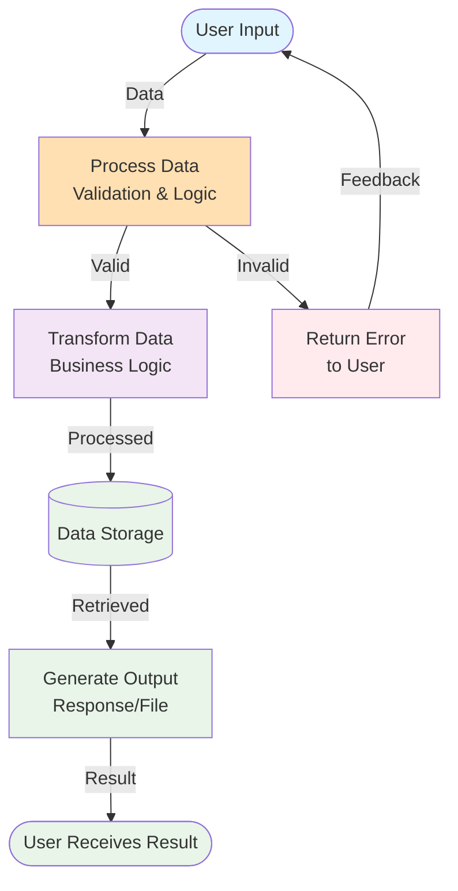

## System Data Flow Diagram

## Legend

- **Blue (Cyan)**: User interaction points
- **Orange**: Processing/validation steps  
- **Purple**: Data transformation
- **Green**: Storage and output operations
- **Red**: Error handling

## Description

This diagram shows the basic data flow pattern through the system. Users provide input, which is processed and validated. Valid data flows through business logic transformation, gets stored if needed, and generates appropriate output. Invalid data triggers error handling with user feedback.

**Key Components:**
- Input validation with error feedback loop
- Business logic transformation layer
- Data persistence (if applicable)
- Output generation and delivery

Update this diagram when adding new data processing stages or changing the core system flow.
