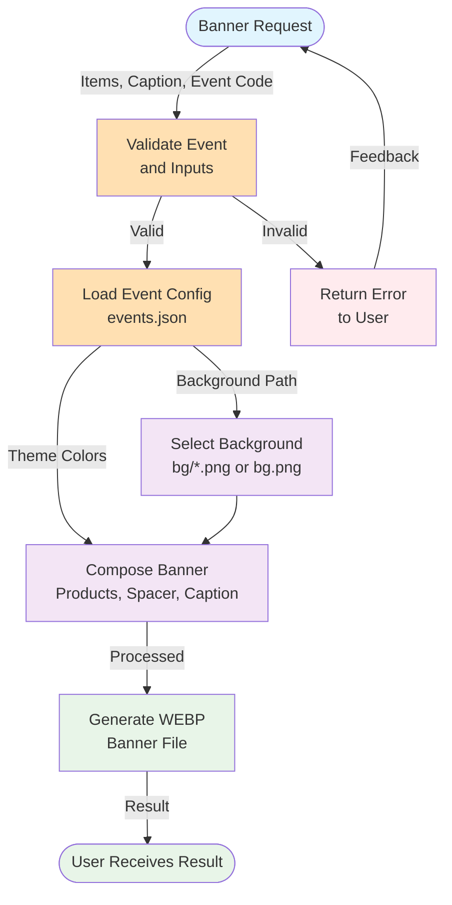

## System Data Flow Diagram

## Legend

- **Blue (Cyan)**: User interaction points
- **Orange**: Processing/validation steps  
- **Purple**: Data transformation
- **Green**: Storage and output operations
- **Red**: Error handling

## Description

This diagram shows the banner generation data flow. Users provide item numbers, caption text, and an event code. Valid requests load event configuration, select the configured event background, compose product imagery with themed caption elements, and generate a WEBP output. Invalid requests return actionable errors.

**Key Components:**
- Event and input validation with error feedback loop
- Event configuration-driven background and theme selection
- Product image and caption composition
- WEBP output generation and delivery

Update this diagram when adding new data processing stages or changing the core system flow.
