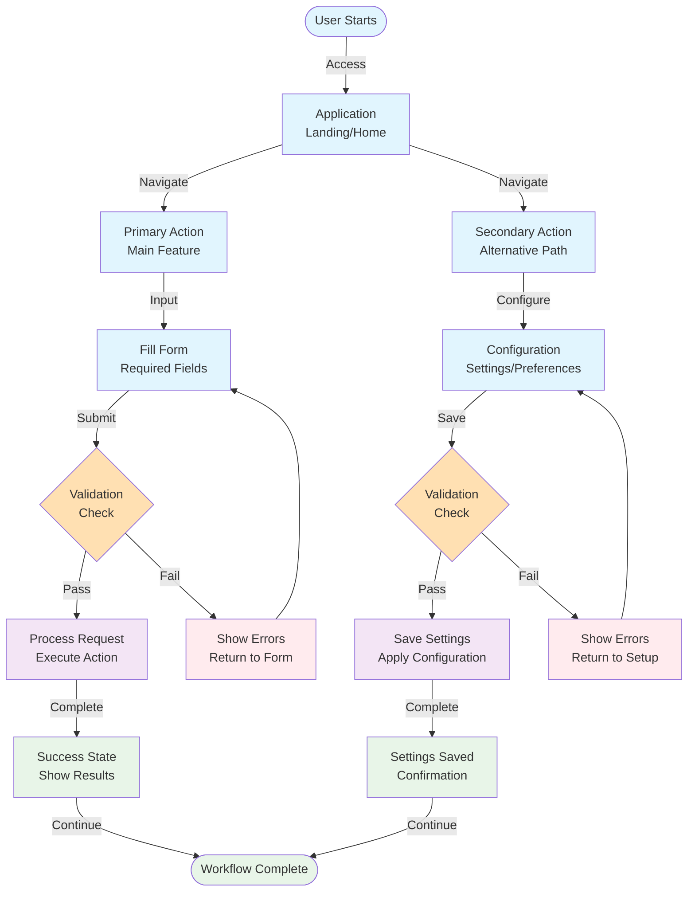

## User Workflow Diagram

## Workflow Description

This diagram represents the typical user journey through the application. Users start at a landing point and can choose between primary and secondary actions. Each path includes form filling or configuration, validation with error handling, processing, and success states.

**Key Features:**
- Multiple user entry paths
- Form validation with error feedback loops
- Clear success/error states
- Consistent user experience patterns

**Interaction Patterns:**
- All forms include validation with error recovery
- Success states provide clear feedback  
- Error states guide users back to correction points
- Workflow supports both primary and alternative user goals

Update this diagram when adding new user interaction paths or changing the core user experience flow.
